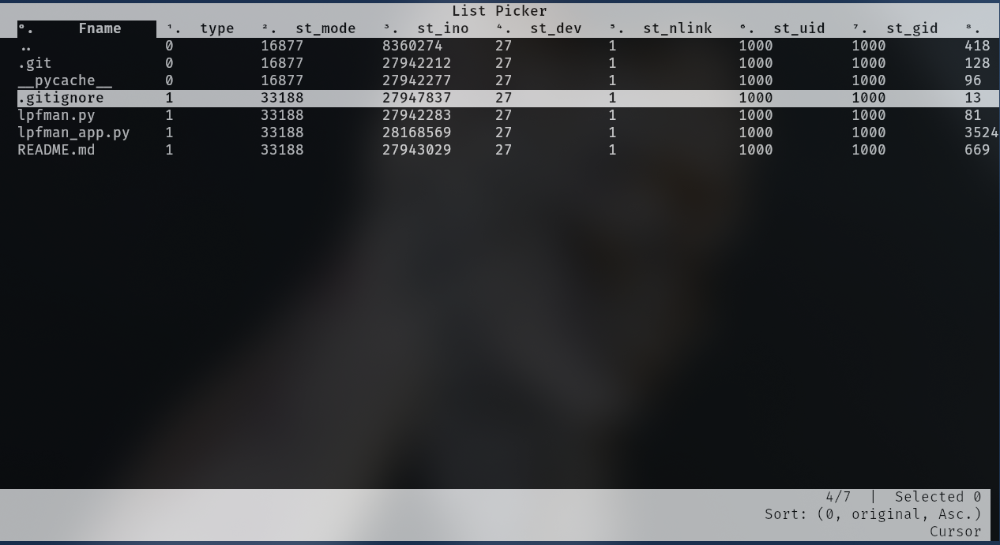

# lpfman

lpfman is a basic TUI file manager. This was developed in a short time simply to demonstrate the capabilities of list_picker.

<div align="center">  </div>

# Quickstart

As list_picker is in active development you will need to clone it as well

```
git clone https://github.com/grimandgreedy/list_picker

cd list_picker && python -m pip install -r requirements

git clone https://github.com/grimandgreedy/lpfman
```

Run the file manager:

```python lpfman.py```

# Features

 - File navigation
 - Display of file properties
 - File launching

# Important
 
This project is not being actively developed. There are many great TUI file managers. This is just for demonstration purposes.


