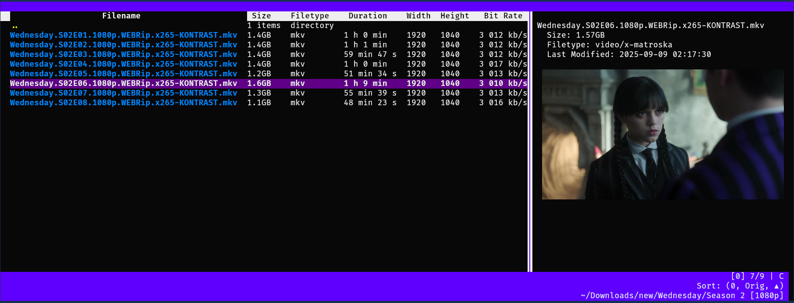

# lpfman

** Though many key features have been implemented, lpfman is in an early stage of development and is not yet ready for distribution. **

lpfman is a terminal-based file manager which supports the display of detailed file attributes--a feature sorely lacking in all other TUI-FMs. Column data is generated asynchronously using multiple threads with visible rows being prioritised in the task queue. Many column presets are available but you can also provide your own column generation functions in your columns.toml config file.

<div align="center">  </div>
<div align="center">  </div>

# Quickstart

As list_picker is in active development you will need to clone it as well

```
git clone https://github.com/grimandgreedy/lpfman

cd lpfman

python -m pip install -e ./
```

Run the file manager:

```lpfman```

# Features

 - File navigation
 - Extensive column-data support
 - Display of file properties
 - File launching
 - File previews
   - Image previews using: kitty icat, ueberzug
     - Including thumbnails for video, audio, pdf, epub and mobi files.
   - Code preview with syntax highlighting
 - Sorting
 - Searching


